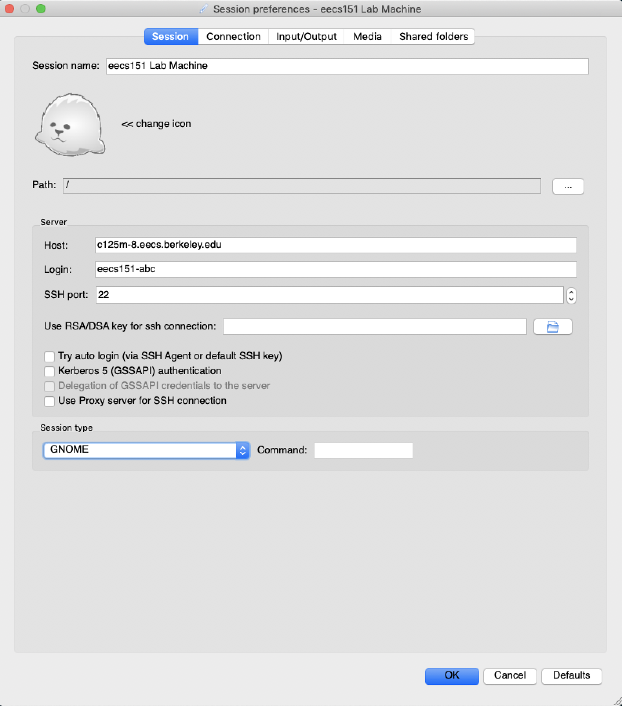
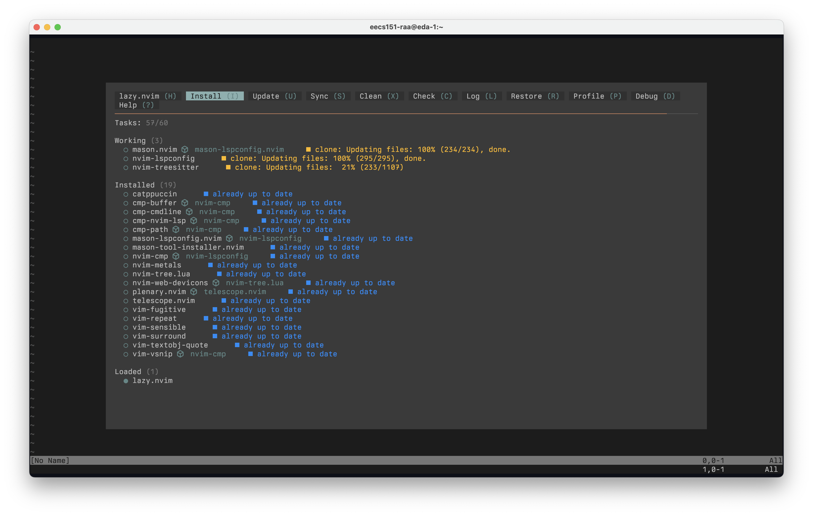
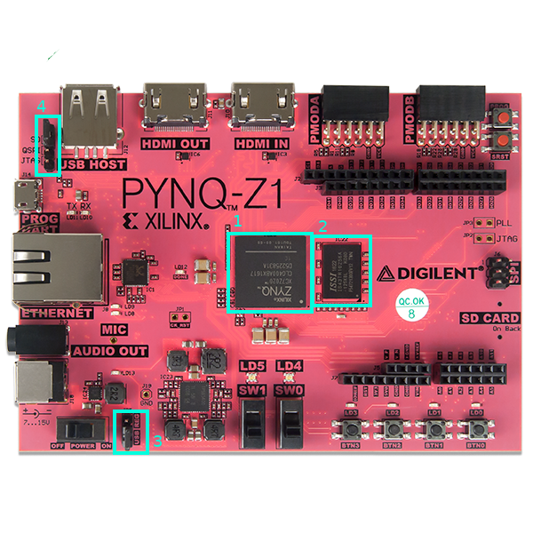
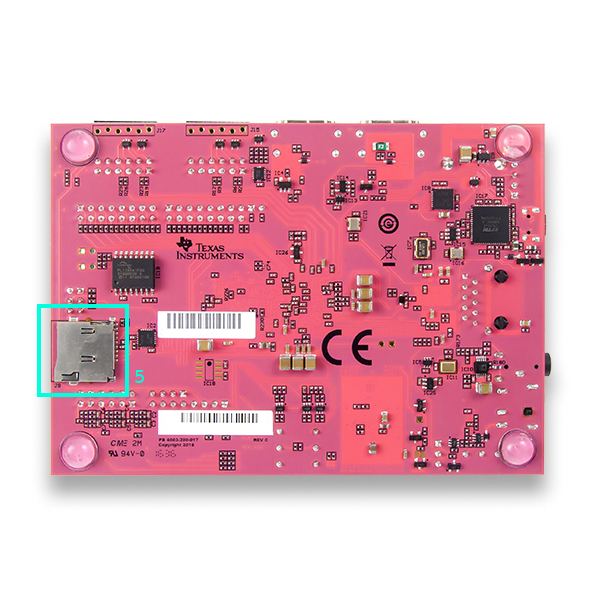

# FPGA Lab 1: Getting Set Up - Accounts, FPGA Board, Vivado, Basic Verilog
<p align="center">
Prof. John Wawrzynek
</p>
<p align="center">
TAs: (ordered by section) Daniel Endraws, Dhruv Vaish, Rohit Kanagal
</p>
<p align="center">
Department of Electrical Engineering and Computer Science
</p>
<p align="center">
College of Engineering, University of California, Berkeley
</p>

This lab will introduce you to the EECS 151 compute infrastructure, our development board, and some basic Verilog.

<details> 
<summary> Table of Contents </summary>

- [FPGA Lab 1: Getting Set Up - Accounts, FPGA Board, Vivado, Basic Verilog](#fpga-lab-1-getting-set-up---accounts-fpga-board-vivado-basic-verilog)
  - [Setting Up Accounts](#setting-up-accounts)
    - [Getting an EECS 151 Account](#getting-an-eecs-151-account)
    - [Login To a Workstation](#login-to-a-workstation)
      - [On a workstation](#on-a-workstation)
      - [From your laptop](#from-your-laptop)
      - [From off-campus network](#from-off-campus-network)
    - [SSH Keys](#ssh-keys)
    - [Some Notes for Remote Login](#some-notes-for-remote-login)
      - [SSH Session Management](#ssh-session-management)
      - [Use SSH keys to login without a password](#use-ssh-keys-to-login-without-a-password)
      - [Use X2go for a remote desktop](#use-x2go-for-a-remote-desktop)
  - [Getting Familiar with our Development Environment](#getting-familiar-with-our-development-environment)
    - [Linux Basics](#linux-basics)
      - [Path Resolution](#path-resolution)
      - [Disk Usage](#disk-usage)
      - [Text Editors](#text-editors)
    - [Git Basics](#git-basics)
      - [Merge Conflicts](#merge-conflicts)
    - [Question 1: Setup](#question-1-setup)
    - [Question 2: Common terminal tasks](#question-2-common-terminal-tasks)
  - [Our Development Board - Xilinx PYNQ-Z1](#our-development-board---xilinx-pynq-z1)
    - [Board Features](#board-features)
    - [The FPGA - xc7z020clg400-1](#the-fpga---xc7z020clg400-1)
    - [Question 3: Understanding your FPGA](#question-3-understanding-your-fpga)
  - [FPGA Build Flow](#fpga-build-flow)
    - [Get CAD Tools on Your `$PATH`](#get-cad-tools-on-your-path)
    - [Clone Your GitHub Repository](#clone-your-github-repository)
    - [Verilog](#verilog)
    - [Constraints](#constraints)
    - [Synthesis](#synthesis)
    - [Inspect Synthesized Design](#inspect-synthesized-design)
    - [Place and Route and Generate Bitstream](#place-and-route-and-generate-bitstream)
    - [Inspect Implemented Design](#inspect-implemented-design)
    - [Program the FPGA](#program-the-fpga)
    - [Design Reports and Logs](#design-reports-and-logs)
  - [Exercise](#exercise)
  - [Lab Deliverables](#lab-deliverables)
  - [Acknowledgement](#acknowledgement)


</details>

## Setting Up Accounts

### Getting an EECS 151 Account
All students in the FPGA lab are required to get a EECS 151 class account to login to the workstations in lab.

To get a computer account, go to [this webapp](http://inst.eecs.berkeley.edu/webacct).
Login using your CalNet ID, click on 'Get a new account' in the eecs151 row.
It will create your account immediately. You can return there for forgotten login names or passwords.

Please let us know if you are unable to get an account.


### Login To a Workstation
The workstations used for this class are `c111-[1-17].eecs.berkeley.edu` (the physical lab machines in Cory 111) and `eda-[1-4].eecs.berkeley.edu ` (higher performance servers).

Not all lab workstations will necessarily be available at a given time, so try a different one if you're having trouble logging in.

You can use any lab machine, but if everyone uses the same one, everyone will find that their jobs perform poorly. Design tools are resource intensive and will not run well when there are too many simultaneous users on these machines.

We recommend that every time you want to log into a machine, examine its load on [Hivemind](https://hivemind.eecs.berkeley.edu/) or using `top`/`htop` when you log in. If it is heavily loaded, consider using a different machine. If you notice other users with jobs consuming excessive resources, feel free to reach out to the TAs about it.

#### On a workstation
Turn on the monitor and login using your `eecs151-xxx` login name and password.

#### From your laptop
You can access the workstations through SSH.

Login to a lab machine by SSHing with your class account `eecs151-xxx`.
```shell
ssh eecs151-xxx@c111-2.eecs.berkeley.edu
```


#### From off-campus network
You need to connect via a Berkeley VPN before you can access the lab machines via ssh.
Please visit [this page](https://security.berkeley.edu/services/bsecure/bsecure-remote-access-vpn) and scroll down to "How to Get Started" section if you haven't configured the Berkeley VPN before.

If you are still unable to ssh, try setting the VPN Gateway to "Library Access and Full Tunnel".


### SSH Keys
We will use SSH keys to authenticate with Github.
Run these commands when logged in on your `eecs151-xxx` account.

- Create a new SSH key:
```shell
ssh-keygen -t ed25519 -C "your_email@berkeley.edu"
```
Keep hitting enter to use the default settings.
You can set up a passphrase if you want, then you'll need to type it whenever you ssh using public key.

- Copy your public key:
```
cat ~/.ssh/id_ed25519.pub
```
Copy the text that's printed out.

- Add the key to your Github account. [Go here](https://github.com/settings/keys), click on "New SSH Key", paste your public key, and click "Add SSH key".

- Finally test your SSH connection
```shell
ssh -T git@github.com
Hi <username>! You've successfully authenticated, but GitHub does not provide shell access.
```

If you want to work on the labs directly from your laptop instead of via a workstation, you should repeat this process on your laptop (using WSL on Windows and the terminal on OSX or Linux).


### Some Notes for Remote Login
If you're using the lab machines from your laptop, here are a few more things you might want to do.

NOTE: Each of the Cory 111 machines is connected to one FPGA board.
**You should only program the FPGAs when you are physically in the lab, and you should make sure that you are programming
from the machine you are physically using.**
You don't need to be present in the lab to write Verilog or run simulations, and you can do these tasks on any `c111` or `eda` machine.

#### SSH Session Management
We recommend that you utilize SSH session management tools and that all terminal-based work be done over SSH. This would allow your remote terminal sessions to remain active even if your SSH session disconnects, intentionally or not (i.e. you wouldn't need to keep you're laptop open while running long jobs).

Here is a good tutorial for [tmux](https://hamvocke.com/blog/a-quick-and-easy-guide-to-tmux/)

#### Use SSH keys to login without a password
Use the same instructions from above to generate a public/private key pair on your laptop (if you don't already have one).
Run this from your laptop to copy your public key to the lab machine.
```shell
ssh-copy-id eecs151-xxx@c111-2.eecs.berkeley.edu
```

Now you should be able to ssh to the lab machine without providing a password.
```shell
ssh eecs151-xxx@c111-2.eecs.berkeley.edu
```

You can also add the following snippet to your ssh config (located at `~/.ssh/config`). You should then be able to ssh into a EDA server or Cory 111 Desktop by typing `ssh eda-[1-4]` or `ssh c111-[1-17]` (no other flags required).

```
Host eda-*
  HostName %h.eecs.berkeley.edu
  User eecs151-XXX
  ForwardAgent yes
Host c111-*
  HostName %h.eecs.berkeley.edu
  User eecs151-XXX
  ForwardAgent yes
```

#### Use X2go for a remote desktop
To run software on the lab machine that requires a graphical user interface (e.g. firefox, vivado GUI), you should use `x2go`.
[Install it from here](https://wiki.x2go.org/doku.php/download:start) (or install the `x2goclient` package if you're using Linux).

Open `x2go`, create new session with the following settings (use your `eecs151-xxx` class account in the "Login" field). You might also need to specify the location of your private key for access without a password. For “Session type”, select “GNOME”. Here’s an example from macOS:

<p align="center">

</p>

Click the session on the right bar to start it, and you should see a Gnome desktop environment running on Red Hat Enterprise Linux 8.
This desktop is running on the lab machine of your choice and is being forwarded to you by `x2go`.

For best compatibility, please use X2go rather than NoMachine to remotely login.

## Getting Familiar with our Development Environment

### Linux Basics
We will be using a Linux development environment.
If you are unfamiliar or uncomfortable with Linux, and in particular, using the bash shell, you should definitely check out [this tutorial](https://www.digitalocean.com/community/tutorial_series/getting-started-with-linux).

It is highly recommended to go through all four parts of the tutorial above.
To complete the labs and projects for this course, you will need good command line skills.

One of the best ways to expand your working knowledge of bash is to watch others who are more experienced. Pay attention when you are watching someone else's screen and ask questions when you see something you don't understand. You will quickly learn many new commands and shortcuts.

Some common commands:

#### Path Resolution
To use the CAD tools in this class, you will need to load the class environment. All of the tools are already installed on the network filesystem, but by default users do not have the tools in their path. Try locating a program that is already installed (vim) and another which is not (innovus) by default:

```shell
which vim
which innovus
```

The vim program has been installed in: /usr/bin/vim. If you show the contents of /usr/bin, you will notice that you can launch any of programs by typing their filename. This is because /usr/bin is in the environment variable $PATH, which contains different directories to search in a colon-separated list.

```shell
echo $PATH
```
To be able to access the CAD tools, you will need to append to their location to the $`PATH` variable:

```shell
source /home/ff/eecs151/asic/eecs151.bashrc
echo $PATH
which innovus
```

#### Disk Usage
There are a few miscellaneous commands to analyze disk usage on the servers.

```shell
du -ch --max-depth=1 .
df -H
```

Finally, your instructional accounts have disk usage quotas. Find out how much you are allocated and how much you are using:

```shell
quota -s
```

It is important to ensure you have enough space for your work, by either keeping your directories clean or completing work in the `/home/tmp` directory, and then copying any important results to your home directory. 
Your personal workspace, `/home/tmp/<your-eecs-username>` can be created by logging into the [EECS Instructional WebAccount](http://inst.eecs.berkeley.edu/webacct) with your CalNet ID. Click on `More...`, then select `Make /home/tmp Directory`

#### Text Editors

As an editor built-in to the instructional machine, vim is highly efficient and requires no additional installation to use, so we will take a closer look to it. If you have never used Vim, please follow the tutorial [here](http://www.openvim.com/tutorial.html).
If you would prefer to learn Emacs, you can read [this webpage](http://www.gnu.org/software/emacs/tour/) and run the Emacs built-in tutorial with Ctrl-h followed by t. Feel free to search for other resources online to learn more.

While Vim is a powerful editor and ubiquitous on Linux environments, there are other alternatives that might be more suitable for different use cases. A modern graphical text editor is Visual Studio Code, which supports editing text files through an SSH session. To set up Visual Studio Code for remote development, please follow the tutorial [here](https://code.visualstudio.com/docs/remote/ssh-tutorial).

**EECS 151 Vim Config**

The commands `vi`, `vim`, and `nvim` are linked to a customized version of [NeoVim](https://neovim.io) for this class. It includes language intelligence (syntax errors, possible linting mistakes) via the [Verible](https://github.com/chipsalliance/verible) language server, useful keyboard shortcuts, and a cool dark theme. When you first launch vim you'll probably see a plugin manager screen pop up like this, which you can press `q` to close after it's done installing plugins. You'll know its done when the theme gets applied.

<p align="center">

</p>

Some normal-mode shortcuts available in the default config include... (`<Leader>` is a backslash, to execute the shortcut first press backslash and then the other keys in order).

- `<Leader> s` - toggle the sidebar
- `<Leader> p p` - search file names in current directory
- `<Leader> p g` - search file contents for all files in current directory
- `<Leader> b d` - go to definition
- `<Leader> b e` - go to declaration
- `<Leader> b h` - show tooltip for current word
- `<Leader> t <number><Enter>` - set tab to automatically become `<number>` spaces
- to see the rest, `cat ~/.config/nvim/lua/keybinds.lua`

Warning: If you want to customize the config, feel free to customize it for yourself. Note that once you choose to customize the config you won't get updates from course staff anymore, so do this at your own risk!

```bash
# See the warning above before running this!
rm -i ~/.config/nvim
cp -r /home/ff/eecs151/tools-151/neovim/config ~/.config/nvim
# Now you can edit the config files in ~/.config/nvim, for example to set a custom theme.
```

**EECS 151 VSCode Config**

When you open the lab directory in VSCode for the first time you may be notified of workspace-recommended plugins. We recommend that you accept the installation when prompted, as they can help you spot bugs!


### Git Basics
In this class, we will be using Git, one of the most popular version control systems.
We recommend *pushing your changes to the remote repository constantly* for backup. It sometimes happens that students lose their local data by accident. **You are responsible for your data**.

Feel free to skip this section if you already have some prior experience with using git.

Version control systems help track how files change over time and make it easier for collaborators to work on the same files and share their changes.
For projects of any reasonable complexity, some sort of version control is an absolute necessity.

Make the effort to understand how Git works, as it will make understanding how to actually use it much easier.
Please check out [this link](http://git-scm.com/book/en/Getting-Started-Git-Basics), which provides a good high level overview.

Once you think you understand the material above, please complete [this tutorial](http://try.github.com) upto and including the `Setting up Git` section. The instructional machines already have Git installed. We will be cloning the FPGA lab repo with SSH in the next section. 

Git is a very powerful tool, but it can be a bit overwhelming at first. If you don't know what you are doing, you can really cause lots of headaches for yourself and those around you, so please be careful. If you are ever doubtful about how to do something with Git ask a TA or an experienced classmate.

For the purposes of this class you will probably only need to be proficient with the following commands:
- `git status`
- `git add`
- `git commit`
- `git pull`
- `git push`
- `git clone`

However, if you put in the effort to learn how to use some of the more powerful features (diff, blame, branch, log, mergetool, rebase, and many others), they can really increase your productivity.

*Optional*: If you would like to explore further, check out the [slightly more advanced tutorial written for CS250](http://inst.eecs.berkeley.edu/~cs250/fa13/handouts/tut1-git.pdf)

#### Merge Conflicts

It may be the case that staff needs to make an update on already released labs, and if you have already edited skeleton code you may run into a merge conflict. 
In this case you will have to tell git which changes you want to keep, check out [this link](https://docs.github.com/en/pull-requests/collaborating-with-pull-requests/addressing-merge-conflicts/resolving-a-merge-conflict-using-the-command-line) for a quick way to deal with such merge conflicts.

<p align="center"><b>
Once you've completed the above guide, answer the following questions on the corresponding gradescope assignment.
</b></p>

### Question 1: Setup
1. Show the output of running `ssh -T git@github.com` on the lab machines.
2. What is your instructional account's disk quota (to the nearest GB)? Do files in your temporary directory count against your quota?
3. What text editor are you using?
4. Which instructional machine(s) should you use while completing the labs and the project?

### Question 2: Common terminal tasks

For 1-6 below, submit the command/keystrokes needed to generate the desired result.  For 1-4, try generating only the desired result (no extraneous info). 

1. List the 5 most recently modified items in `/usr/bin`
2. What directory is `git` installed in?
3. Show the hidden files in your lab directory (the `lab1` folder in the repo you cloned from GitHub).
4. What version of Vim is installed? Describe how you figured this out.
5. (optional) Make a new directory called `backup` within `/home/tmp/<your-eecs-username>`. Copy all the files in this lab directory to the new `backup` directory and then delete all the copies in the new directory.
6. Run `ping www.google.com`, suspend it, then kill the process. Then run it in the background, report its PID, then kill the process.
7. Run `top` and report the average CPU load, the highest CPU job, and the amount of memory used (just report the results for this question; you don't need to supply the command/how you got it).


## Our Development Board - Xilinx PYNQ-Z1

For the labs in this class, we will be using the Xilinx PYNQ-Z1 development board which is built on the Zynq development platform.
Our development board is a printed circuit board that contains a Zynq-7000 System-on-Chip (SoC) along with a host of peripheral ICs and connections.
The development board makes it easy to program the FPGA and allows us to experiment with different peripherals.

The reference documentation for this board can be found [here](https://reference.digilentinc.com/reference/programmable-logic/pynq-z1/reference-manual).

### Board Features
Here are some highlighted features of the PYNQ-Z1 board.
<table border=0>
<tr>
    <td>
        
        <p align=center>Top of PYNQ-Z1 board</p>
    </td>
    <td>
          
          <p align=center>Bottom of PYNQ-Z1 board</p>
    </td>
</tr>
</table>

1. Z-7020 System-on-Chip (SoC) of the Zynq-7000 SoC family. It comprises a hardened dual-core ARM processor and the Xilinx FPGA xc7z020clg400-1. The SoC connects to the peripheral ICs and I/O connectors via PCB traces.
1. ISSI 512MB off-chip DRAM.
1. Power source jumper: shorting "REG" has the board use the external power adapter as a power source; shorting "USB" has it rely on the 5 V provided by USB. The latter is enough unless your design needs to power a lot of external peripherals.
1. Programming mode jumper to select how we want to use the ARM processor. There are two available modes: Operating-System mode (booting Linux from SD card) or Bare-metal mode. Since we are not using the ARM processor, we avoid this for now.
1. SD card slot for inserting an SD card to boot Linux. Since we are not using the ARM processor, we avoid this for now.


### The FPGA - xc7z020clg400-1

`xc7z020clg400-1` is the part ID of our FPGA. How should we interpret it?
`xc7z020` is the part number which identifies a specific device from a Xilinx FPGA family (in this case, it belongs to a Zynq family from the 7-series).
`clg400` is the package number which defines the number of package IO pins.
`-1` is the speed grade.
So, our FPGA is an Artix-7 Programmable Logic fabric which is a low-end 7-series Xilinx FPGA family (the mid-end and high-end of the 7-series are Kintex-7 and Virtex-7 families, respectively).

FPGAs are usually attributed by their logic capacities. You should be aware of the device resource of your target FPGA when designing your digital circuit (it is unlike the software world where a CPU or GPU should be able to compile and run whatever code throwing at it regardless of the code size). Early FPGAs employ primitive blocks such as LUTs or FFs (Flip-flops) for logic implementation. Then the FPGA vendors started adding hardened blocks such as fast carry adders, block memories (BRAM) and Digital Signal Processing (DSP) slices onto FPGAs to augment their capability. The carry adder macros can implement fast arithmetic and comparison operations, the BRAMs provide fast on-chip storage, and the DSP slices are able to compute multipliers very efficiently, among many other operations. State-of-the-art FPGAs also incorporate floating-point calculation capability in those hardened blocks, thus greatly enhance the performance and expand their applicability. FPGA now has evolved to a competitive programmable platform, and there are many real-world applications that can be accelerated on the FPGAs, such as networking, wireless, biology, video/image processing, finance, or deep learning.

<p align="center"><b>
Skim through the following documents and submit answers for the questions below (Gradescope assignment)
</b></p>

- Page 2 of the [Zynq-7000 Product Selection Guide](https://www.xilinx.com/support/documentation/selection-guides/zynq-7000-product-selection-guide.pdf)
- Chapter 21 of the [Technical Reference Manual](https://docs.xilinx.com/viewer/book-attachment/mxcNFn1EFZjLI1eShoEn5w/pnoMLQXFIWQ6Jhoj0BUsTQ)
  - [Non-PDF Version](https://docs.xilinx.com/r/en-US/ug585-zynq-7000-SoC-TRM)
- Chapter 2 of the [Xilinx 7-series Configurable Logic Block User Guide](http://www.xilinx.com/support/documentation/user_guides/ug474_7Series_CLB.pdf).


### Question 3: Understanding your FPGA
1. How many LUTs, FFs, Block RAMs (number of 36Kb blocks), and DSP slices are on the xc7z020 FPGA?
1. How many slices are in a single CLB?
1. What is the difference between a SLICEL and a SLICEM?
1. How many LUTs are in a slice?
1. How many inputs do each of the LUTs have?
1. How many slices do you need to implement a logic function of 8 inputs?


## FPGA Build Flow

Before we begin the lab, we should familiarize ourselves with the CAD (computer aided design) tools that translate a circuit implemented in a Hardware Description Language (such as Verilog) into a bitstream that configures the FPGA.
These tools will pass your design through several stages, starting with logic synthesis, followed by placement and routing.
The final stage generates a bitstream ready to download to your FPGA.

The CAD tool provided by Xilinx is Vivado Design Suite.
Vivado has an integrated scripting capability (using the Tcl language -- pronounced "tickle") which allows users to write Tcl commands to interact with Vivado using a command-line interface.

### Get CAD Tools on Your `$PATH`
- Add the following line to your `~/.bashrc` file:
```bash
source /home/ff/eecs151/eecs151_fpga.sh
```
- Close your SSH sessions / log out and log back in
- Make sure `which vivado` returns `/share/instsww/xilinx/Vivado/2021.1/bin/vivado`


### Clone Your GitHub Repository

You will need to clone this repository into your instructional account. 

Please click the following link and accept the assignment.

[Lab Repository](https://classroom.github.com/a/otrKDthv)

GitHub Classroom will automatically generate a new repository with all of the lab files. Over the course of the class, you may make changes to this repository and commit them to save your work. At the end of the semester, you should be able to fork this repository to keep all of your work. You may also clone from multiple machines and make changes to your code without having to VPN into the lab machine. 

Please clone the repository generated by GitHub Classroom to your instructional account. You may ask your TA if you need help with this. It is usually easiest to place the repository in the home directoy `~/`. 

```bash
git clone git@github.com:EECS151-sp24/fpga_labs_sp24-(your GitHub user ID).git
```

Now, `cd` into the cloned directory. 
Add the staff skeleton as a remote in order to pull any changes to the lab and starter code for future labs.

```shell
git remote add skeleton https://github.com/EECS150/fpga_labs_sp24.git
```
You should now see both your github classroom and the staff skeleton if you run `git remote -v`. 
You can run `git pull skeleton main` to pull any updates to the skeleton. 
See [Merge Conflicts](#merge-conflicts) if you run into any conflicts pulling staff code.


### Verilog
Throughout the semester, you will build increasingly complex designs using Verilog, a widely used hardware description language (HDL).

Open up the `lab1/src/z1top.v` file.
This file contains a Verilog module description with specified input and output signals.
The `z1top` module describes the *top-level* of the FPGA logic: it has access to the signals that come into and out of the FPGA chip.

The `BUTTONS` input is a signal that is 4 bits wide (as indicated by the [3:0] width descriptor).
This input comes from the push-buttons on the bottom right side of your Pynq-Z1 board.

The `SWITCHES` input, which is 2 bits wide (as indicated by the [1:0] descriptor), comes from the slide switches on the Pynq-Z1, located just to the left of the buttons (look for SW0 and SW1).

The `LEDS` output is a signal that is 6 bits wide (as indicated by the [5:0] width descriptor).
This output signal connectes to the bank of LEDs at the bottom right of the Pynq-Z1, just above the buttons.
Almost. There are only 4 LEDs there; 2 more are tri-color LEDs located just above the slide switches in the middle.

In this file, we can describe how the slide switches, push buttons and LEDs are connected through the FPGA. There is one line of code that describes an AND gate that takes the values of one of the buttons and one of the slide switches, ANDs them together, and sends that signal out to the first LED.

The syntax to create an AND gate driving an output `o` with gate inputs `a` and `b` is:
```verilog
and(o, a, b);
```


### Constraints
Constraints files, such as `lab1/src/z1top.xdc`, attach metadata to the Verilog source using Tcl commands that Vivado understands.
One critical piece of metadata is the mapping between FPGA input/output pins and signal names used in the top-level `z1top` module.

Open up the constraint file in `lab1/src/z1top.xdc`.
This file, which contains several Tcl commands, specifies some IO pin mappings.
Note how the signals in the Verilog code correlate with the pin-mapping commands in this file.

Let's see one example:
```tcl
set_property -dict { PACKAGE_PIN R14 IOSTANDARD LVCMOS33 } [get_ports { LEDS[0] }];
```

This line assigns the properties `PACKAGE_PIN` and `IOSTANDARD` with the values `R14` and `LVCMOS33` (respectively) to the port `LEDS[0]`, a signal we use as an output of `z1top`. Each of these properties has a separate consequence in the synthesis process.

- The pin to which the `LEDS[0]` signal should be connected to is given by the physical pin `R14` on the FPGA package.
- The logic convention (maximum voltage, what ranges constitute low and high, etc) for that port will be `LVCMOS33`.

To understand where `R14` came from, you should inspect Sheet #9 of the [PYNQ-Z1 schematic](https://reference.digilentinc.com/_media/reference/programmable-logic/pynq-z1/pynq-z1\_sch.pdf).
Note that `R14` is the name of an FPGA pin which is connected to the `LED0` net on the PCB which drives an LED component.


### Synthesis
If we have a Verilog source file, and device specific constraints, we can run synthesis with Vivado to convert the behavioral Verilog to a device-specific netlist which contains only FPGA primitives such as LUTs and IO buffers.
We have provided a Makefile that automates calling Vivado.

Inside `lab1` **run** `make setup`.
This will generate a file `build/target.tcl` that sets some Tcl variables that point to the Verilog sources and constraints in your design.

Next **run** `make synth` which will synthesize `z1top.v` using Vivado.
`make synth` calls Vivado and tells it to invoke the commands in the `scripts/synth.tcl` file.

In that file you will find Vivado Tcl commands such as:
```tcl
synth_design -top ${TOP} -part ${FPGA_PART}
write_checkpoint -force ${TOP}.dcp
```
These commands are documented [here](https://www.xilinx.com/support/documentation/sw_manuals/xilinx2021_1/ug835-vivado-tcl-commands.pdf).
`synth_design` runs synthesis with the loaded Verilog and XDC files, and `write_checkpoint` writes a file that contains the entire design state and can be opened by the Vivado GUI.

Note that you may a warning regarding the PS7 block/cell, but this is safe to ignore since we aren't using the ARM core in the Zynq chip for this lab.


### Inspect Synthesized Design
Look at `build/synth/post_synth.v`.
Note that the `z1top` module only contains FPGA primitives such as LUT2, IBUF (input buffer), and OBUF (output buffer).

You should open the checkpoint `build/synth/z1top.dcp` in Vivado.
Run `make vivado` to launch the Vivado GUI, and navigate through **File > Checkpoint > Open** to select the file.

In the left hand "Netlist" window, expand "Leaf Cells", right click on `BUTTONS_IBUF[0]_inst`, and select "Schematic".
Now you can expand the schematic by right clicking on the "O" port of the IBUF, and selecting **Expand Cone > To Leaf Cells**.
This will be a useful debugging technique in the future.


### Place and Route and Generate Bitstream
After synthesis, we can use Vivado to place and route the post-synthesis netlist and generate a bitstream to program the FPGA.
Placement places the primitives in the netlist to the physical locations on the FPGA.
Routing connects the placed blocks together using switch blocks and wires on the FPGA.
The next step is timing analysis which evaluates if your design meets the target clock constraint (this only applies if your design has sequential elements, such as flip-flops or block RAMs).

We have automated this: **run** `make impl` in `lab1`.
The `impl` make target is similar to the `synth` one, and it uses the commands in the `scripts/impl.tcl` file.

Disregard warnings about timing analysis.


### Inspect Implemented Design
Open the checkpoint `build/impl/z1top_routed.dcp` in Vivado.
You will see the device floorplan of the FPGA chip.
Can you locate the LUT cell that implements the 2-input AND gate from the source Verilog?

You will need to zoom into the floorplan view to find it.
Click the **Routing Resources** button on the menu bar of the "Device" window to toggle the display of the routing wires that connect the IO pins and the LUT.


### Program the FPGA
Do this only when you are physically in the lab. Make sure nobady else is programming or running the FPGA of the workstation you're using.

Check if the FPGA board is on, otherwise turn it on.

**Run** `make program` to upload the bitstream to the FPGA.
Note that if you make any changes to the Verilog, `make program` will rerun all the previous steps and program the FPGA with the new bitstream.
If you want to program the FPGA with the current bitstream in `build/impl` even if you changed the Verilog, use the `make program-force` target.

Does it work? Does the LED state reflect the logical AND of the button and switch?


### Design Reports and Logs
Reports are generated at each step in the Vivado build flow.
They are stored in `build/synth` and `build/impl` with the suffix `.rpt` or `.log`.

`*drc.rpt` will alert you if there are any design rule violations in your design.
`*utilization.rpt` will tell you how many LUTs, FFs, BRAMs, DSPs are used.
`*timing_summary.rpt` will tell you whether your circuit meets the target clock constraint.
You can open the reports from your terminal using your favorite text editor.

The following reports are particularly important and you should pay attention to when evaluating, debugging, or optimizing your design.
- `build/synth/post_synth_utilization.rpt`: Resource utilization report after synthesis.
- `build/impl/post_place_utilization.rpt`: Resource utilization report after placement.
- `build/impl/post_route_timing_summary.rpt`: Timing summary report after routing.

You will often find the `.log` (`build/synth/synth.log`, `build/impl/impl.log`) files helpful if you suspect Vivado is optimizing out a signal or if there are unexpected warnings.


## Exercise
Modify the sample code to implement the following functionality: the second LED light (`LEDS[1]`) is on only when all four buttons (`BUTTONS[3:0]`) are pressed.

*Note*: You can declare wires in Verilog to hold intermediate boolean signals:
```verilog
input in1, in2, in3;
output out;

wire a, b;

and(a, in1, in2);
or(b, a, in3);
and(out, b, a);
```


## Lab Deliverables
**Lab Checkoff:** due at the start of next lab (January 29/30)

To checkoff for this lab, have these things ready to show the TA:
  - Gradescope submission for the three questions
    - [Question 1: Setup](#question-1-setup)
    - [Question 2: Common terminal tasks](#question-2-common-terminal-tasks)
    - [Question 3: Understanding your FPGA](#question-3-understanding-your-fpga)
  - Demonstrate that the logic circuit you modified in the exercise works correctly on the FPGA board. We may ask you to restart the board (turn off and then turn on) and program it.


## Acknowledgement
This lab is the result of the work of many EECS151/251 GSIs over the years including:
- Sp12: James Parker, Daiwei Li, Shaoyi Cheng
- Sp13: Shaoyi Cheng, Vincent Lee
- Fa14: Simon Scott, Ian Juch
- Fa15: James Martin
- Fa16: Vighnesh Iyer
- Fa17: George Alexandrov, Vighnesh Iyer, Nathan Narevsky
- Sp18: Arya Reais-Parsi, Taehwan Kim
- Fa18: Ali Moin, George Alexandrov, Andy Zhou
- Sp19: Christopher Yarp, Arya Reais-Parsi
- Fa19: Vighnesh Iyer, Rebekah Zhao, Ryan Kaveh
- Sp20: Tan Nguyen
- Fa20: Charles Hong, Kareem Ahmad, Zhenghan Lin
- Sp21: Sean Huang, Tan Nguyen
- Fa21: Vighnesh Iyer, Charles Hong, Zhenghan Lin, Alisha Menon
- Sp22: Alisha Menon, Yikuan Chen
- Fa22: Yikuan Chen, Raghav Gupta, Jennifer Zhou
- Sp23: Rahul Kumar, Yukio Miyasaka, Dhruv Vaish
- Fa23: Rahul Kumar, Rohan Kumar
- Sp24: Daniel Endraws, Dhruv Vaish
