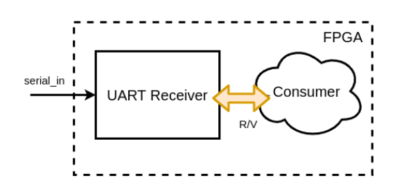
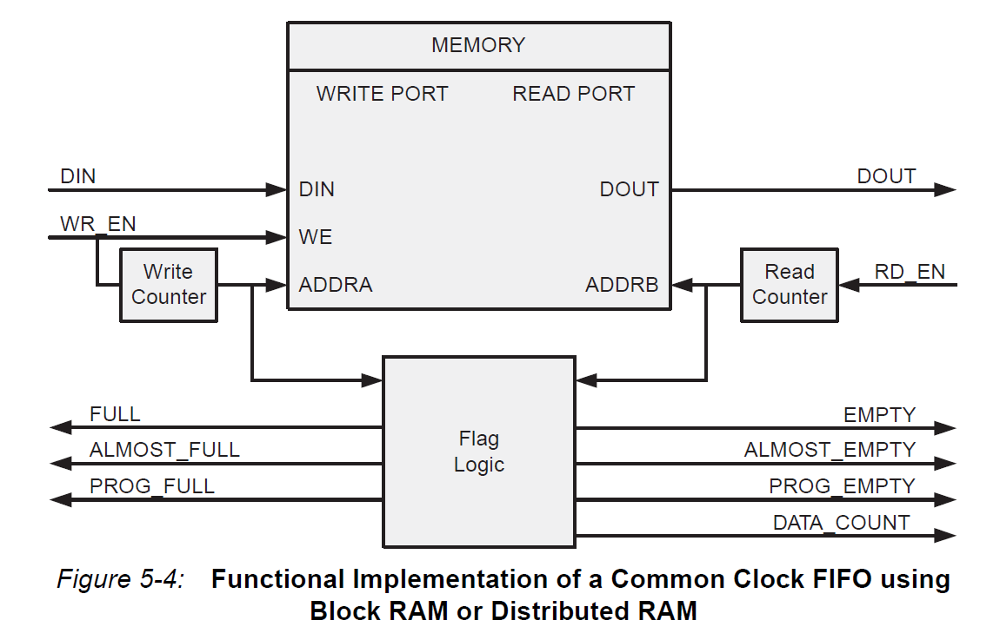

# FPGA Lab 5: UART, FIFO, Memory Controller
<p align="center">
Prof. John Wawryznek 
</p>
<p align="center">
TAs: (ordered by section) Daniel Endraws, Dhruv Vaish, Rohit Kanagal
<p align="center">
Department of Electrical Engineering and Computer Science
</p>
<p align="center">
College of Engineering, University of California, Berkeley
</p>

## Overview
In this lab we will:

- Understand the ready-valid interface
- Design a universal asynchronous receiver/transmitter (UART) circuit
- Design a first-in-first-out (FIFO) circuit 

There is no FPGA testing required for this part.

### Before You Begin

Ensure you have committed and pushed previous changes to your github classroom, then fetch the latest lab skeleton
```shell
cd fpga-labs-<username>
git pull staff main
```
If you face any divergent branch issues, merge the staff changes into your branch with `git merge staff/main`

Copy the following sources from the previous lab
 - `lab5/src/debouncer.v`
 - `lab5/src/synchronizer.v`
 - `lab5/src/edge_detector.v`

 Remember that you must not use any `always @(posedge clk)` blocks in modules intended for synthesis.
 Use the registers in the `EECS151.v` library instead.
 Using `always @(posedge clk)` in testbenches is fine, since they are not synthesizable.

### Reading
- Read this document on [ready-valid interfaces](https://www.eecs151.org/files/verilog/ready_valid_interface.pdf)

### Debugging

If your Verilog isn't working as expected, here are some things you should check:
* Does `make lint` report any errors/warnings (besides the `UNOPTFLAT` issue)?
* Are you using any `posedge clk` blocks? You should only be using combinational always blocks.
* Are all your registers instantiations of the ones in the `EECS151.v` library?
* Are there any inferred latches in the synthesis logs? Any warnings about multi-driven nets?
  If a variable is assigned in one combinational logic branch, remember that it must be assigned in **all** branches.
* Have you looked at the waveforms for relevant signals?
  Look for off-by-one-cycle timing issues and Xs (red waveforms).
* Does your code use non-synthesizable constructs?
  Ensure you are not using system functions, delays, or X's/Z's in modules you intend to synthesize.


<details open>

<summary> Table of Contents (click to close) </summary>

- [FPGA Lab 5: UART, FIFO, Memory Controller](#fpga-lab-5-uart-fifo-memory-controller)
  - [Overview](#overview)
    - [Before You Begin](#before-you-begin)
    - [Reading](#reading)
    - [Debugging](#debugging)
  - [Ready-Valid Interfaces](#ready-valid-interfaces)
  - [UART Serial Device](#uart-serial-device)
    - [UART Packet Framing](#uart-packet-framing)
    - [UART Receiver](#uart-receiver)
    - [UART Transmitter](#uart-transmitter)
    - [UART Transmitter Verification](#uart-transmitter-verification)
  - [FIFO](#fifo)
    - [FIFO Functionality](#fifo-functionality)
    - [FIFO Interface](#fifo-interface)
    - [FIFO Timing](#fifo-timing)
    - [FIFO Testing](#fifo-testing)
    - [FIFO Verification (Optional)](#fifo-verification-optional)
  - [Lab Deliverables](#lab-deliverables)
  - [Acknowledgement](#acknowledgement)
</summary>


## Ready-Valid Interfaces
Often, we want to design modules that pass data between each other but are unaware of each other's internal timing.
The *ready-valid interface* is a standardized interface and protocol for timing-agnostic unidirectional data transfer between 2 modules that share a clock.

The ready-valid interface is used to send data from a *source* to a *sink*.

<p align=center>
  
</p>

It consists of 3 wires:
  - `valid` (1 bit, driven by source, received by sink)
  - `data` (D bits, driven by source, received by sink)
  - `ready` (1 bit, driven by sink, received by source)

The sink uses the `ready` signal to tell the source if the sink is able to receive a new piece of data.
Usually the sink can only take in a certain number of data pieces until it is full and has to process what it has already received before it can receive any more.

The source uses the `valid` signal to tell the sink that the `data` bus has data it wishes to send to the sink.

A ready-valid *transaction* only occurs when both `ready` and `valid` are high on a rising clock edge.
If both `ready` and `valid` are high on a rising edge, the source can assume that the sink has received and *internally stored* the bits on `data`.

Here are a few examples:
<!--
wavedrom.com/editor.html
{signal: [
  {name: 'clk', wave: 'p......'},
  {name: 'data', wave: 'x3x33x.', data: ['a', 'x', 'b']},
  {name: 'valid', wave: '010.10.'},
  {name: 'ready', wave: '1......'}
]}
Save a .svg from the wavedrom webapp
Then to convert to .png
rsvg-convert image.svg -f pdf -o image.pdf
convert -density 300 image.pdf image.png
-->

<p align=center>
  
</p>

There are two transactions that take place on the 3rd and 6th rising clock edges.
Note that the source can change `data` when `valid` is low.

<p align=center>
  
</p>
<!--
{signal: [
  {name: 'clk', wave: 'p......'},
  {name: 'data', wave: 'x3..3.x', data: ['a', 'b']},
  {name: 'valid', wave: '01....0'},
  {name: 'ready', wave: '10.1010'}
]}
-->

The sink can pull `ready` low whenever it isn't ready to accept new data.
In this example, there are 2 transactions that take place on the 5th and 7th rising clock edges.
When the source has `valid` high, but the sink has `ready` low we say that the sink is applying *backpressure* to the source.

The data transfer from source to sink only occurs when *both* `ready` and `valid` are high on a rising edge.

## UART Serial Device
In this lab, we will design a circuit that implements the UART serial protocol for transmitting and receiving data over a serial interface.
This will enables circuits on the FPGA to communicate with the workstation, which will allow us to programmatically send data to and from the FPGA.

UART is a 2 wire protocol with one wire carrying data from the workstation to the FPGA and the other one carrying data from the FPGA to the workstation.
Here is an overview of the setup we will use:

<p align=center>
  
</p>
<p align=center>
  <em>Diagram of the entire setup</em>
</p>

The UART transmit and receive modules use a *ready-valid interface* to communicate with other modules on the FPGA.
Both the UART’s receive and transmit modules will have their own separate ready-valid interface connected appropriately to other modules.

Please note that the serial line itself is not a ready/valid interface.
Rather, it is the modules you will work with in this lab (`uart_transmitter` and `uart_receiver`) that use the ready-valid handshake.

### UART Packet Framing
On the `PYNQ-Z1` board, the physical signaling aspects (such as voltage level) of the serial connection will be taken care of by off-FPGA devices.
From the FPGA's perspective, there are two signals, `FPGA_SERIAL_RX` and `FPGA_SERIAL_TX`, which correspond to the receive-side and transmit-side pins of the serial port.
The FPGA's job is to correctly frame 8-bit data words going back and forth across the serial connection.
The figure below shows how a single 8-bit data word is transferred over the serial line using the UART protocol.

<p align=center>
  
</p>
<p align=center>
  <em>Framing of a UART packet</em>
</p>

In the idle state the serial line is held high.
When the TX side is ready to send a 8-bit word, it pulls the line low.
This is called the start bit.
Because UART is an asynchronous protocol, all timing within the frame is relative to when the start bit is first sent (or detected, on the receive side).

The frame is divided into 10 uniformly sized bits: the start bit, 8 data bits, and then the stop bit.
The width of a bit in cycles of the system clock is given by the system clock frequency (`125 MHz`) divided by the baudrate.
The baudrate is the number of bits sent per second; in this lab the baudrate will be **115200**.
Notice that both sides must agree on a baudrate for this scheme to be feasible.

### UART Receiver
<p align=center>
  
</p>
<p align=center>
  <em>Connectivity of the UART receiver</em>
</p>

The receive side of the UART is just a shift register that shifts bits in from the serial line.
However, care must be taken into determining *when* to shift bits in.
If we attempt to sample the `FPGA_SERIAL_RX` signal directly on the edge between two symbols, we are likely to sample on the wrong side of the edge and get the wrong value for that bit.
One solution is to wait halfway into a cycle (until `SampleTime` on the diagram) before reading a bit in to the shift register.

The UART receiver module sends the received 8-bit word to a consumer block on the FPGA via a ready-valid interface.
Once we have received a full UART packet over the serial port, the `valid` signal should go high until the `ready` signal goes high, after which the `valid` signal will be driven low until we receive another UART packet.

You do not need to implement the UART receiver as it is provided to you in `lab5/src/uart_receiver.v`, but you should refer to its implementation when writing the `uart_transmitter`.

### UART Transmitter
<p align=center>
  
</p>
<p align=center>
  <em>Connectivity of the UART transmitter</em>
</p>

The UART Transmitter receives an 8-bit word from a producer block on FPGA via the ready-valid interface.
Once we have a 8-bit word that we want to send (i.e., once `valid` is high, and the transmitter is `ready`), transmitting it involves shifting each bit of the `data[7:0]` bus, plus the start and stop bits, out of a shift register on to the serial line.

Remember, the serial baudrate is much slower than the system clock, so we must wait `SymbolEdgeTime = ClockFreq / BaudRate` cycles between changing the bit we're putting on the serial line.
After we have shifted all 10 bits out of the shift register, we are done unless we have to send another frame immediately after.
The transmitter should not be `ready` when it is in a middle of sending a frame.

**Your task** is to complete the implementation of the UART transmitter in `lab5/src/uart_transmitter.v`.

### UART Transmitter Verification
We have provided 2 testbenches to verify the UART transmitter.
  - `sim/uart_transmitter_tb.v`
  - `sim/uart2uart_tb.v`

You can run them as usual; they will print out any errors during execution.

## FIFO
A FIFO (first in, first out) data buffer is a circuit that allows data elements to be queued through a write interface, and read out sequentially by a read interface.
The FIFO we will build in this section will have both the read and write interfaces clocked by the same clock; this circuit is known as a synchronous FIFO.

### FIFO Functionality
A FIFO is implemented with a circular buffer and two pointers: a read pointer and a write pointer.
These pointers address the buffer inside the FIFO, and they indicate where the next read or write operation should be performed.
When the FIFO is reset, these pointers are set to the same value.

When a write to the FIFO is performed, the write pointer increments and the data provided to the FIFO is written to the buffer.
When a read from the FIFO is performed, the read pointer increments, and the data present at the read pointer's location is sent out of the FIFO.

When the read pointer equals the write pointer, the FIFO is either full or empty.
The implementation of the FIFO logic is up to you,
but you may wish to store one extra bit of state to distinguish these two conditions.
The `Electronics` section of the [FIFO Wikipedia article](https://en.wikipedia.org/wiki/FIFO_(computing_and_electronics)) will likely aid you in creating your FIFO.

Here is a block diagram of a FIFO similar to the one you should create, from page 103 of the [Xilinx FIFO IP Manual](https://www.xilinx.com/support/documentation/ip_documentation/fifo_generator_ug175.pdf).

<p align=center>
  
</p>

The interface of our FIFO will contain a *subset* of the signals enumerated in the diagram above.

### FIFO Interface
Look at the FIFO skeleton in `src/fifo.v`.

The FIFO is parameterized by:
  - `WIDTH` - The number of bits per entry in the FIFO
  - `DEPTH` - The number of entries in the FIFO.
  - `POINTER_WIDTH` - The width of the read and write pointers.

The common FIFO signals are:
  - `clk` - Clock used for both read and write interfaces of the FIFO.
  - `rst` - Reset (synchronous with `clk`); should force the FIFO to become empty.

The FIFO write interface consists of:
  - `input wr_en` - When this signal is high, on the rising edge of the clock, the data on `din` should be written to the FIFO.
  - `input [WIDTH-1:0] din` - The data to be written to the FIFO.
  - `output full` - When this signal is high, the FIFO is full.
When the FIFO is full, you should not accept any new data, even if `wr_en` is high.

The FIFO read interface consists of:
  - `input rd_en` - When this signal is high, on the rising edge of the clock, the FIFO should output the data indexed by the read pointer on `dout`.
  - `output [WIDTH-1:0] dout` - The data that was read from the FIFO after the rising edge on which `rd_en` was asserted.
  - `output empty` - When this signal is high, the FIFO is empty.
Attempting to read from an empty FIFO (by raising `rd_en`) should not corrupt any of the internal state of your FIFO.

### FIFO Timing
The FIFO that you design should conform to the specs above.
Here is a timing diagram for a *2-entry* FIFO.
Note that the data on `dout` only changes *after the rising edge* when `rd_en` is high.

<p align=center>
  
</p>

<!--
https://wavedrom.com/editor.html
{signal: [
  {name: 'clk', wave: 'p........'},
  {name: 'wr_en', wave: '01.0.....'},
  {name: 'din', wave: 'x44x.....', data: ['a', 'b']},
  {name: 'full', wave: '0..1.0...'},
  {},
  {name: 'dout', wave: 'xxxxx5.5.', data: ['a', 'b']},
  {name: 'empty', wave: '1.0....1.'},
  {name: 'rd_en', wave: '0...1010.'}
]}
-->

### FIFO Testing
We have provided a testbench in `sim/fifo_tb.v`.

The testbench performs the following test sequence:
- Checks initial conditions after reset (FIFO not full and is empty)
- Generates random data which will be used for testing
- Pushes the data into the FIFO, and checks at every step that the FIFO is no longer empty
- When the last piece of data has been pushed into the FIFO, it checks that the FIFO is not empty and is full
- Verifies that cycling the clock and trying to overflow the FIFO doesn't cause any corruption of data or corruption of the full and empty flags
- Reads the data from the FIFO, and checks at every step that the FIFO is no longer full
- When the last piece of data has been read from the FIFO, it checks that the FIFO is not full and is empty
- Verifies that cycling the clock and trying to underflow the FIFO doesn't cause any corruption of data or corruption of the full and empty flags
- Checks that the data read from the FIFO matches the data that was originally written to the FIFO
- Prints out test debug info

This testbench tests one particular way of interfacing with the FIFO.
Of course, it is not comprehensive, and there are conditions and access patterns it does not test.
As writing testbenches is a very valuable skill, we **highly recommend** adding some more tests to this testbench (or writing a new testbench) to verify your FIFO performs as expected.
Here are a few tests to try:
  - Several times in a row, write to, then read from the FIFO with no clock cycle delays.
      This will test the FIFO in a way that it's likely to be used when buffering user I/O.
  - Try writing and reading from the FIFO on the same cycle.
      This will require you to use fork/join to run two threads in parallel.
      Make sure that no data gets corrupted.

### FIFO Verification (Optional)

To more powerfully verify the FIFO in a much more concise manner, we can implement a few basic SystemVerilog Assertions (SVA).
Read/skim through [this tutorial](https://www.systemverilog.io/verification/sva-basics/),
then try to implement properties/assertions to verify the following **concurrently**:

1. When the FIFO is full, the write pointer does not change unless reset is asserted.
1. When the FIFO is empty, the read pointer does not change unless reset is asserted.
1. When reset is asserted, the read and write pointers are set to 0, and full is deasserted.

The assertions you write can be placed in `fifo.v`.

It is possible to write more sophisticated assertions to check, for example,
that the data you read from the FIFO equals the data you wrote to it.


## Lab Deliverables
**Lab Checkoff (due: next lab)**

Once you have finished implementing and testing the UART and FIFO, you are done with lab 5!

Commit and push your code to GitHub.
Check that you are not pushing generated files (such as waveform dumps).
Do commit the Verilog source for any testbenches you write/modify.

To checkoff for this lab, have these things ready to show the TA:
  - Go through the UART simulation results and show that your UART behaves as expected. What do the testbenches do?
  - Go through the FIFO simulation results and show it works correctly.
You are not required to program your design on an FPGA for Lab 5 (in Lab 6, we’ll use your FIFO and UART from Lab 5).

## Acknowledgement
This lab is the result of the work of many EECS151/251 GSIs over the years including:
- Sp12: James Parker, Daiwei Li, Shaoyi Cheng
- Sp13: Shaoyi Cheng, Vincent Lee
- Fa14: Simon Scott, Ian Juch
- Fa15: James Martin
- Fa16: Vighnesh Iyer
- Fa17: George Alexandrov, Vighnesh Iyer, Nathan Narevsky
- Sp18: Arya Reais-Parsi, Taehwan Kim
- Fa18: Ali Moin, George Alexandrov, Andy Zhou
- Sp19: Christopher Yarp, Arya Reais-Parsi
- Fa19: Vighnesh Iyer, Rebekah Zhao, Ryan Kaveh
- Sp20: Tan Nguyen
- Fa20: Charles Hong, Kareem Ahmad, Zhenghan Lin
- Sp21: Sean Huang, Tan Nguyen
- Fa21: Vighnesh Iyer, Charles Hong, Zhenghan Lin, Alisha Menon
- Sp22: Alisha Menon, Yikuan Chen, Seah Kim
- Fa22: Yikuan Chen, Raghav Gupta, Ella Schwarz, Paul Kwon, Jennifer Zhou
- Sp23: Rahul Kumar, Yukio Miyasaka, Dhruv Vaish
- Fa23: Nikhil Jha
- Sp24: Daniel Endraws
