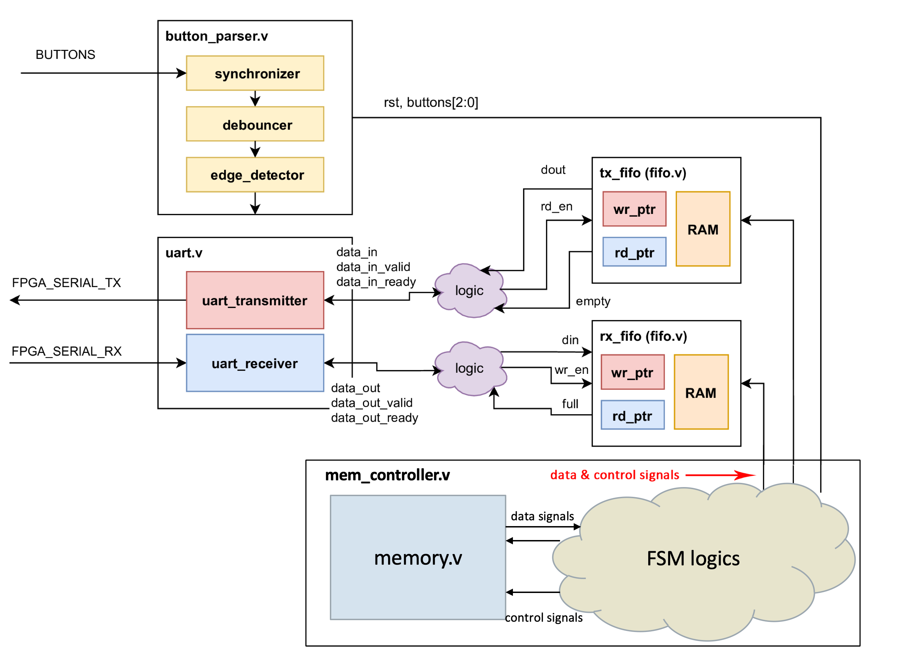
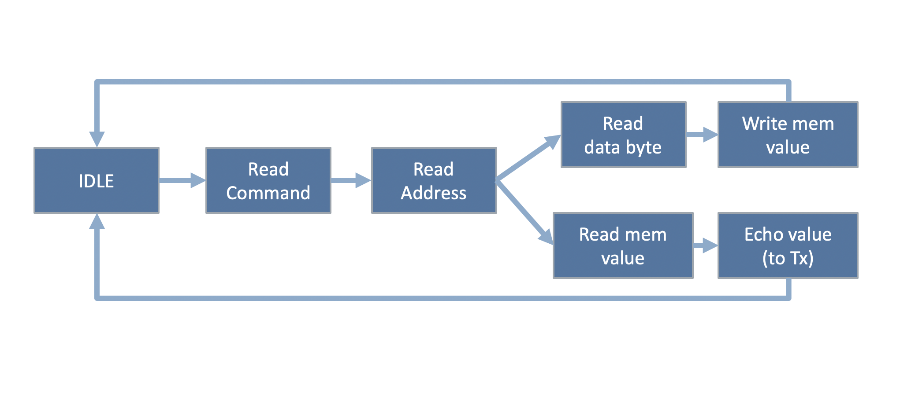
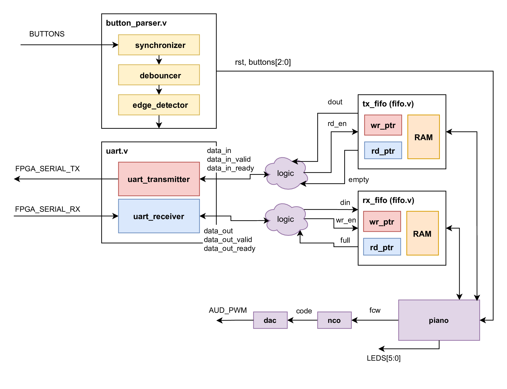

# FPGA Lab 6: Memory Controller
<p align="center">
Prof. John Wawryznek 
</p>
<p align="center">
TAs: (ordered by section) Daniel Endraws, Dhruv Vaish, Rohit Kanagal
<p align="center">
Department of Electrical Engineering and Computer Science
</p>
<p align="center">
College of Engineering, University of California, Berkeley
</p>

## Overview

In this lab we will:
- Connect the FIFO and UART circuits together, bridging two ready-valid interfaces.
- Design a memory controller that takes read and write commands from a FIFO, interacts with a synchronous memory accordingly, and returns read results over another FIFO.
- Optional - build a fixed length piano.

This part will involve testing your design on FPGA.

### Before You Begin

Ensure you have committed and pushed previous changes to your github classroom, then fetch the latest lab skeleton
```shell
cd fpga-labs-<username>
git pull staff main
```
If you face any divergent branch issues, merge the staff changes into your branch with `git merge staff/main`, fixing any merge conflicts.

Also copy the following sources from previous labs:
```shell
cp lab4/src/synchronizer.v lab4/src/debouncer.v lab4/src/edge_detector.v lab6/src
cp lab5/src/fifo.v lab5/src/uart_transmitter.v lab6/src
```


Remember that you must not use any `always @(posedge clk)` blocks in modules intended for synthesis.
Use the registers in the `EECS151.v` library instead.
 Using `always @(posedge clk)` in testbenches is fine, since they are not synthesizable.


<details open>

<summary> Table of Contents (click to close) </summary>

- [FPGA Lab 6: Memory Controller](#fpga-lab-6-memory-controller)
  - [Overview](#overview)
    - [Before You Begin](#before-you-begin)
  - [Memory Controller](#memory-controller)
    - [Read/Write Packet](#readwrite-packet)
    - [Operation of the Memory Controller](#operation-of-the-memory-controller)
    - [Running the testbench](#running-the-testbench)
  - [On the FPGA](#on-the-fpga)
    - [PMOD USB-UART](#pmod-usb-uart)
    - [Hello World](#hello-world)
  - [Lab Deliverables](#lab-deliverables)
  - [Optional - Fixed Note Length Piano](#optional---fixed-note-length-piano)
    - [Modify z1top](#modify-z1top)
    - [Writing a System-Level Testbench](#writing-a-system-level-testbench)
    - [FPGA Testing](#fpga-testing)
  - [Acknowledgement](#acknowledgement)

</details>

## Memory Controller

One of the key enabling blocks for the RISC-V CPU on the Final Project of this course is Memory-Mapped I/O. Specifically, we will use UART that we build in this lab to interface between a host computer and a synchronous memory block. An instance of its use is to write instructions into the instruction memory with the UART interface so our CPU can run those instructions. In this lab, we will build a simple UART-FIFO-MEMORY interface to get you familiarized with working with RAMs.

<p align=center>
  
</p>
<p align=center>
  <em>Block diagram of the system, note that the connections here are just for the purpose of illustration and do not represent all connections</em>
</p>

### Read/Write Packet
The host side (your workstation computer) will send a two-byte packet (for read operation) or a three-byte packet (for write operation) to the FPGA via UART. 
<p align=center>
  
</p>
<p align=center>
  <em>Format of data packets, write (ASCII '1' = 8'd49) is 1 on the keyboard, and read (ASCII '0' = 8'd48) is 0 on the keyboard</em>
</p>


### Operation of the Memory Controller
<!-- There are two modes of operation that you need to implement in memory_controller.v, which are controlled by SWITCH[0] on your FPGA board. -->
The role of the memory controller is to handle memory reads and writes based on commands
that the user sends from the host computer. Each operation is a multi-cycle process which
consists of different states. You do not need to support simultaneous reads and writes.

This module uses a `SYNC_RAM_WBE` from the `EECS151.v` library, which is a synchronous read RAM with a write byte enable signal. In order to handle memory reads and writes, your FSM needs to set the `mem_din` (memory input data), `mem_addr` (memory address), `mem_we` (memory write enable)
and FIFO communication signals properly.

Commands are either 2 bytes long (for reads), or 3 bytes long (for writes).
The first byte indicates whether you should perform a read or a write.
The second byte is the address to read from or write to.
For write commands, the third byte is the data to write into memory.

1. Your memory controller FSM should start with an IDLE state upon pressing the reset button.
It should make a read (**the 1st byte**) from the RX FIFO whenever the `rx_fifo_empty` signal becomes 0.
Then, it should wait for the next packet (the address byte) to arrive at the FIFO, so it can read that byte (**the 2nd byte**). 
   - *Extremely Important Tip*: Refer to the FIFO timing diagram to see when the FIFO’s output data is valid! Remember we’re using a synchronous FIFO.

1. Next, depending on whether a `Read` (8'd48, or key 0 on the keyboard) or a `Write` (8'd49, or key 1 on the keyboard) command has been received for the first byte, the memory controller transitions into different states.
   - If the command was `Write`, then the FSM should wait for the data byte (**the 3rd byte**) to become available in the FIFO. Once the data byte is read, the controller should write the data byte into the correct address in memory, then return to IDLE.
   - If the command was `Read`, then the value at the corresponding address should be read from the RAM, and then sent to the TX_FIFO (setting control signals accordingly), followed by returning to the IDLE state. Again, remember the implications that a synchronous FIFO has for the timing of your control signals.

You can use `state_leds` to monitor current state on the FPGA. Some states will pass too quickly to be visible, but the "IDLE" and input states involve waiting 
and hence should be easily visible. We will not be testing you on the use of `state_leds`.

<p align=center>
  
</p>
<p align=center>
  <em>Flow diagram of the FSM. Note that transitions back to the current state are not shown here</em>
</p>

Keep in mind that the input bytes might not be sent back-to-back, **so your FSM has to wait in the current state until it receives the next byte**.

We have provided you with a skeleton for the FSM in `src/mem_controller.v`. You will see it is structured like so:
- State update using using `state_reg` register
- Next state logic (`always @(*)`)
- Output and memory signal logic (`always @(*)`)
- Space for registers for byte reading & packet counting, if needed

Please feel free to use a different number of states, or different states, as long as you completely understand the required behavior and the design of your FSM.
However, you should not change the controller interface.

In some FSM implementations, you could see people combining 2 & 3 into the same `always@(*)` block, tt is just personal preference.

### Running the testbench
Once you finish `mem_controller.v` run the `sim/mem_controller_tb.v` testbench.

If the simulation doesn't finish (gets stuck), press `ctrl+c` and type `quit`,
then open up the `dve` tool to check the waveform.
Does the timing of each state transition and control signal look correct (refer to the FIFO timing diagram from lab 5)?

If you see all tests passed, proceed to running the system level testbench `sim/system_tb.v`,
which requires your top level, uart, fifo, and memory controller to all work together.

Note that both `mem_controller_tb.v` and `system_tb.v` require a correct
FIFO to interface with the memory controller.

If everything looks correct, program your FPGA (see next section).

## On the FPGA
Use the standard `make impl` and `make program` to create and program a bitstream.

**Pay attention to the warnings** generated by Vivado in `build/synth/synth.log`.
It's possible to write your Verilog in such a way that it passes behavioural simulation but doesn't work in implementation.
Warnings about `multi driven nets`, for example, can lead to certain logic pathways being optimized out. Latch synthesis is another notable cause of mismatch between simulation and FPGA behavior.

### PMOD USB-UART
The PYNQ-Z1 does not have an RS-232 serial interface connected to the FPGA fabric.
So we'll be using the [PMOD USB-UART](https://store.digilentinc.com/pmod-usbuart-usb-to-uart-interface/) extension module to add a UART interface to the Pynq board.
Connect the PMOD module to the **top** row of the PMOD A port on the Pynq, and connect a USB cable from the USB-UART PMOD to your computer (this is already done in the Cory 111 workstations).

*Note:* Make sure that the power selection jumper on the PMOD USB-UART is set to LCL3V3.

<p align=center>
  
</p>
<p align=center>
  <em>PMOD USB-UART plugged in with correct power jumper setting (blue).</em>
</p>

### Hello World
Make sure `SWITCH[0]` is at "off(0)" position so you are in the memory controller mode. Reset the UART circuit on your FPGA with `buttons[0]`.

On your workstation, run:
```shell
screen $SERIALTTY 115200
```

This opens `screen`, a terminal emulator, connected to the serial device with a baud rate of 115200.
When you type a character into the terminal, it is sent to the FPGA over the `FPGA_SERIAL_RX` line, encoded in ASCII.
When the memory controller sends a new character, it will be pushed over the `FPGA_SERIAL_TX` line to your workstation computer.
When `screen` receives a character, it will display it in the terminal.

<!--- If you have a working design, you can **type a few characters into the terminal** and have them echoed to you.
Make sure that if you type really fast that all characters still display properly.--->

To test your implementation, type one character at a time. Send write packets (remember the byte corresponding to each character will be its ASCII value; ASCII charts are readily available online). Then send read packets with addresses you've written to and ensure you receive the data written earlier. 

If you see some weird garbage symbols then the data is getting corrupted and something is likely wrong. 
If you see this happening very infrequently, don't just hope that it won't happen while the TA is doing the checkoff; take the time now to figure out what is wrong.
UART bugs are a common source of headaches for groups during the final project.

**To close `screen`, type `Ctrl-a` then `Shift-k` and answer `y` to the confirmation prompt.**
If you don't close `screen` properly, other students won't be able to access the serial port on your workstation.

If you try opening `screen` and it terminates after a few seconds with an error saying `Sorry, can't find a PTY` or `Device is busy`, execute the command `killscreen` which will kill all open screen sessions that other students may have left open.
Then run `screen` again.

Use `screen -r` to re-attach to a non-terminated screen session.
You can also reboot the computer to clear all active `screen` sessions.

## Lab Deliverables

**Lab Checkoff (due: next lab)**

To checkoff for this lab, have these things ready to show the TA:
  - Demonstrate on FPGA that it can perform write and read operations with the memory: 1. read after write, in random addresses and orders (e.g. W-R-W-R or W-W-R-R etc.)
  

## Optional - Fixed Note Length Piano

First copy sources from lab 4:
```shell
cp lab4/src/nco.v lab4/src/dac.v lab6/src
```

The piano interfaces the UART with the NCO + DAC. You should be able to switch into this mode (from the memory_controller mode) by switch `SWITCH[0]` to on(1).
Its job is to fetch notes sent from the UART, convert them to a `fcw`, and send them to the `nco` (and `dac`) for a **fixed amount of time**.

<p align=center>
  
</p>
<p align=center>
  <em>Block diagram of the system with fixed-length piano</em>
</p>

**Implement `src/fixed_length_piano.v`**.
It has access to the UART transmitter FIFO, the UART receiver FIFO, and the `nco` inputs.
It also has access to a reset signal and the other buttons.

The piano should implement the following functionality:
- When the UART receiver FIFO contains a character, the FSM should pull the character from the FIFO and echo it back without modification through the UART transmitter FIFO.
- Once a character is pulled, its corresponding `fcw` should be read from the supplied `piano_scale_rom.v`.
- For a fixed amount of time (`note_length`), the note should be played by sending it to the `nco`. When a note isn't being played, the `fcw` should be set to 0
    - The `note_length` should default to 1/5th of a second, and can be changed by a fixed amount with the buttons.
    - `buttons[0]` increases the `note_length` and `buttons[1]` decreases the `note_length`
- Through doing all of this, your FSM should take care to ensure that if a FIFO is full, that it waits until it isn't full before pushing through data.
- You can use the `leds` output for debugging

You don't need to design the `fixed_length_piano` as an explicit FSM with states; the design is entirely up to you.

A ROM containing mappings from ASCII character codes to the `fcw` of the note to be played can be found in `src/piano_scale_rom.v`.

If you wish to re-generate this file, use these commands:

```bash
cd lab6
../scripts/piano_scale_generator scale.txt
../scripts/rom_generator scale.txt src/piano_scale_rom.v 256 24
# Modify piano_scale_rom.v to change the module name to 'piano_scale_rom'
```

It is possible that the UART receiver FIFO can fill up with samples so fast that the piano can't keep up; similar overflow conditions are possible with other parts of this system.
You don't need to concern yourself with detecting 'backpressure' on the entire system and can just assume that your FIFOs are large enough to buffer all the user input.

### Modify z1top
**Open up `z1top.v` and modify it** to include the new modules you wrote by uncommenting the last section of the file.
Wire up the FIFOs and your `fixed_length_piano` + `nco` + `dac` according to the block diagram in the lab intro.


<!--- You will have to add a few lines of logic (purple cloud) representing the bridge between the ready/valid interface and the FIFO's `rd_en, wr_en, full, empty` interface. ---> 

Make sure that you parameterize your FIFOs properly so that they have the proper `WIDTH` and `DEPTH`.
You can make your FIFOs as deep as you want, but 8 should be enough.

### Writing a System-Level Testbench
This design involves many moving parts that communicate with each other.
We want to make sure that the complete integration of our system works as expected.
To that end, you will have to write a system-level testbench that stimulates the top-level of your design and observes the top-level outputs to confirm correct behavior.

We have provided a template for a system testbench in `sim/piano_system_tb.v`.
**Fill in** the `initial` block to test all the parts of the piano.

To make the waveform shorter and easier to debug, you can change the `CYCLES_PER_SECOND` parameter when instantiating `z1top` (and your `fixed_length_piano`) to something much shorter than 1/5th of a second.
You will want to check that the `fcw` being sent to the NCO is correct; you should use hierarchical paths and asserts to do this:
```verilog
assert(top.nco.fcw == 24'dxxxxx);
```

Note, you can get the integer corresponding to a ASCII character in Python (and vice versa):
```python
>>> ord('z')
122
>>> chr(122)
'z'
```

You will also want to check that the characters being sent to `z1top` are being echoed back correctly.
Use the `off_chip_uart`'s `data_out, data_out_valid, data_out_ready` interface to do this.

### FPGA Testing
Generate a bitstream and program the FPGA as usual.
Read the synthesis and implementation reports (`build/synth/synth.log`) to see if there are any unexpected warnings.

You should watch out specifically for warnings like `found x-bit latch` or `x signal unconnected` or `x signal assigned but never used`.
If you see that the synthesis tool inferred a latch, you should definitely fix that warning by completing any if-elseif-else or case statements that don't have a default signal assignment.
The other 2 warning types are dependent on your design and you should ignore them only if you know they are expected.

Once you put your design on the FPGA you can send data to the on-chip UART by using `screen $SERIALTTY 115200`.
The piano keys are mapped such that `z` through `<` go from C3 to C4 (middle C) and `q` through `i` go from C4 to C5.
Holding down shift moves the lower row's octave down and the upper row's octave up.

Use `buttons[0]` to reset the design.
Use `buttons[1]` and `buttons[2]` to change the `note_length` of your piano.

You should test the case where you make the `note_length` long, and fill up your UART FIFO by typing really fast.
Then watch your FIFO drain slowly as each note is played for `note_length` time.


## Acknowledgement
This lab is the result of the work of many EECS151/251 GSIs over the years including:
- Sp12: James Parker, Daiwei Li, Shaoyi Cheng
- Sp13: Shaoyi Cheng, Vincent Lee
- Fa14: Simon Scott, Ian Juch
- Fa15: James Martin
- Fa16: Vighnesh Iyer
- Fa17: George Alexandrov, Vighnesh Iyer, Nathan Narevsky
- Sp18: Arya Reais-Parsi, Taehwan Kim
- Fa18: Ali Moin, George Alexandrov, Andy Zhou
- Sp19: Christopher Yarp, Arya Reais-Parsi
- Fa19: Vighnesh Iyer, Rebekah Zhao, Ryan Kaveh
- Sp20: Tan Nguyen
- Fa20: Charles Hong, Kareem Ahmad, Zhenghan Lin
- Sp21: Sean Huang, Tan Nguyen
- Fa21: Vighnesh Iyer, Charles Hong, Zhenghan Lin, Alisha Menon
- Sp22: Alisha Menon, Yikuan Chen, Seah Kim
- Fa22: Yikuan Chen, Raghav Gupta, Ella Schwarz, Paul Kwon, Jennifer Zhou
- Sp23: Rahul Kumar, Yukio Miyasaka, Dhruv Vaish
- Fa23: Lucy Meng
- Sp24: Daniel Endraws
